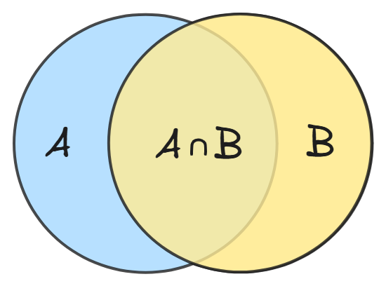
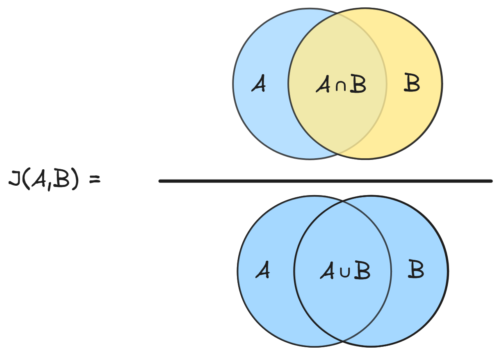
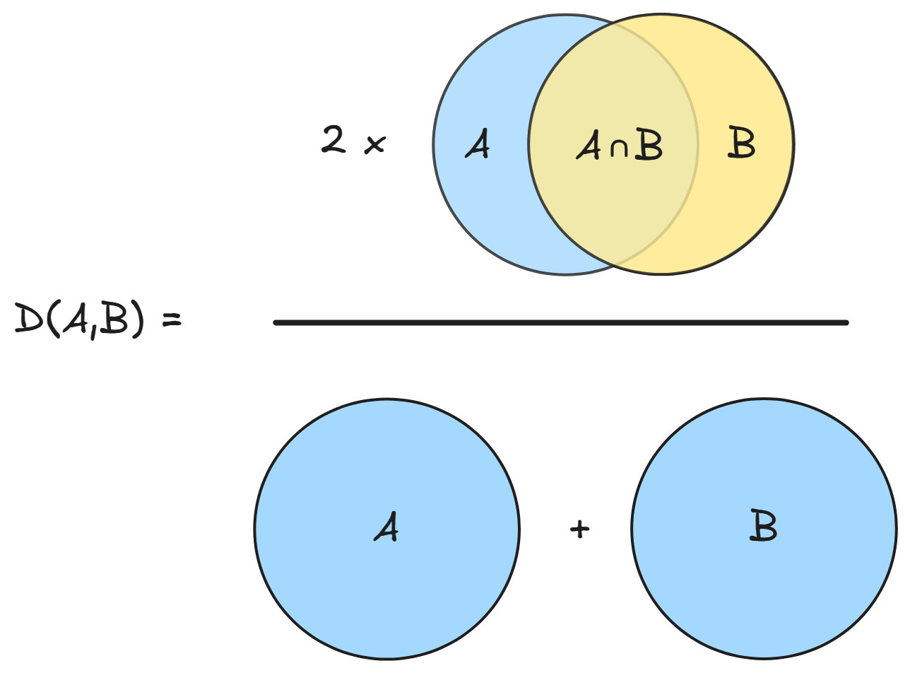

# Sistema de Recomendação

Projeto desenvolvido para estudar algoritmos de recomendação na prática, desde a similaridade entre usuários até a filtragem dos resultados.

A ideia é simples: dado um conjunto de usuários e itens que eles curtiram, o sistema recomenda novos itens baseado no gosto de quem tem perfil parecido.

<br>

## Como funciona

Cada usuário curte itens. O sistema compara o perfil de um usuário com todos os outros, calcula o quanto eles se parecem e sugere itens que o usuário ainda não viu, priorizando os que vieram de usuários mais similares.

O fluxo interno:

1. Para cada outro usuário, calcula a similaridade com o usuário base
2. Itens curtidos por usuários similares ganham pontuação proporcional à similaridade
3. A lista é ordenada por pontuação
4. Um filtro opcional apara o resultado (por tipo, categoria, ou nenhum)
5. As recomendações são retornadas com item e score

<br>

## Arquitetura

O projeto usa o Strategy pattern em duas dimensões independentes: como calcular a similaridade entre usuários e como filtrar o resultado.

```
src/
├── app/
│   └── Main.java
├── model/
│   ├── Item.java
│   ├── TipoItem.java
│   ├── Usuario.java
│   └── Recomendacao.java
├── service/
│   ├── ItemCatalog.java
│   └── SistemaRecomendacao.java
└── strategy/
    ├── similaridade/
    │   ├── SimilaridadeStrategy.java
    │   ├── SimilaridadeItemIntersecao.java
    │   ├── SimilaridadeItemJaccard.java
    │   ├── SimilaridadeItemDice.java
    │   └── SimilaridadeCategoriaJaccard.java
    └── filtro/
        ├── FiltroStrategy.java
        ├── FiltroNenhum.java
        ├── FiltroTipo.java
        └── FiltroCategoria.java
```

Trocar o algoritmo ou o filtro não exige nenhuma mudança no `SistemaRecomendacao`, basta passar uma implementação diferente no construtor.

```java
new SistemaRecomendacao(new SimilaridadeItemJaccard(), new FiltroTipo(TipoItem.FILME), catalog);
new SistemaRecomendacao(new SimilaridadeItemDice(), new FiltroNenhum(), catalog);
```

<br>

## Algoritmos de similaridade

### Interseção

Conta quantos itens dois usuários têm em comum. Simples e direto, sem normalização.

<p align="center">
        
</p>

```
similaridade(A, B) = |A ∩ B|
```

```java
return a.getItensCurtidos()
        .stream()
        .filter(b.getItensCurtidos()::contains)
        .count();
```

<br>

### Jaccard por item

Divide a interseção pela união. Dois usuários que curtiram os mesmos 2 filmes de um total de 2 são mais similares do que dois usuários que curtiram os mesmos 2 filmes de um total de 20.

<p align="center">
        
</p>

```
J(A, B) = |A ∩ B| / |A ∪ B|
```

```java
long intersecao = setA.stream()
        .filter(setB::contains)
        .count();

long uniao = setA.size() + setB.size() - intersecao;

return (double) intersecao / uniao;
```

<br>

### Dice por item

Similar ao Jaccard, mas dá mais peso à interseção. Penaliza menos usuários com perfis grandes.

<p align="center">
        
</p>

```
D(A, B) = 2 * |A ∩ B| / (|A| + |B|)
```

```java
long intersecao = setA.stream()
        .filter(setB::contains)
        .count();

return (2.0 * intersecao) / (setA.size() + setB.size());
```

<br>

### Jaccard por categoria

Ao invés de comparar itens diretamente, compara as categorias dos itens curtidos. Dois usuários que curtiram itens diferentes mas da mesma categoria ainda são considerados similares.

<p align="center">
        
</p>

```
J(A, B) = |categorias(A) ∩ categorias(B)| / |categorias(A) ∪ categorias(B)|
```

```java
Set<String> categoriasA = a.getItensCurtidos().stream()
        .map(item -> item.getCategoria().toLowerCase())
        .collect(Collectors.toSet());

Set<String> categoriasB = b.getItensCurtidos().stream()
        .map(item -> item.getCategoria().toLowerCase())
        .collect(Collectors.toSet());
```

<br>

## Filtros

Os filtros são aplicados após o ranking e recebem o usuário base junto com a lista de candidatos, o que permite filtros que dependem do perfil do usuário.

| Filtro            | Comportamento                                                           |
| ----------------- | ----------------------------------------------------------------------- |
| `FiltroNenhum`    | Retorna todos os candidatos sem modificação                             |
| `FiltroTipo`      | Mantém apenas itens de um tipo específico (FILME, MUSICA, LIVRO)        |
| `FiltroCategoria` | Mantém apenas itens de uma categoria específica (acao, terror, rock...) |

```java
new FiltroTipo(TipoItem.FILME)
new FiltroCategoria("ficcao")
new FiltroNenhum()
```

<br>

## Como rodar

Pré-requisito: Java 17 ou superior.

```bash
git clone https://github.com/seu-usuario/seu-repositorio.git
cd seu-repositorio
javac -d out -sourcepath src src/app/Main.java
java -cp out app.Main
```

`Main.java` é uma demo de teste. Ela monta um catálogo simples, cadastra usuários, simula curtidas e imprime as recomendações para cada combinação de algoritmo e filtro.

<br>

## Tecnologias

Java 21, sem dependências externas.
